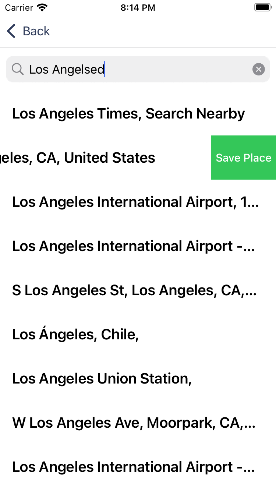

# Тестовое задание Mobile (Swift)
> Михайлюк Владимир

  
  
  
  
  
  

### Description
* Clean Architecture 
* Realm Database
* Swift Package Manager

1. 5 day weather forecast.
2. Detailed information about the weather in the city since of the app for the next 24 hours.
3. Save a location to favorites.
4. If the API was fetched 3 hours ago, local Realm data will be used, otherwise, we fetch the API newly.

### Installation
1. Download the source code or clone the repository.
2. Get free API key from [OpenWeatherMap](http://openweathermap.org).
3. Open `OpenWeatherAPI.swift` and fill `apiKey = ""` with your own API key.
4. Run the simulator
